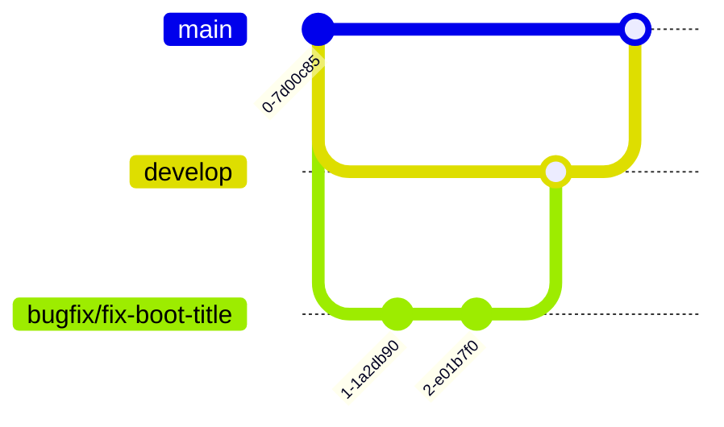

# Contributing to Alya OS

## Branch Strategy

```
main         ← Always stable, production-ready
develop      ← Current development
feature/*    ← New features (post-RC1 only)
bugfix/*     ← Bug fixes
release/*    ← Release preparation
hotfix/*     ← Emergency fixes
```

## Rules

1. **No direct commits to `main`.** Every change goes through a Pull Request.
2. **Every PR must pass GitHub Actions.** If the build fails, merge is blocked.
3. **Never modify `build.sh` for CI.** The build system must remain CI-agnostic.
4. **Never modify files in `upstream/`.** This is a read-only git clone of CachyOS-Live-ISO.
5. **Keep overlay changes minimal.** Prefer patches over overlays. Prefer config over patches.

## Development Workflow



1. Fork the repository
2. Create a branch from `develop`
3. Make changes (see [Rules](#rules))
4. Run `./build.sh` locally to verify the build
5. Push and create a Pull Request to `develop`
6. Wait for CI to pass
7. Request review

## CI/CD Pipeline

| Workflow | Status | Description |
|----------|--------|-------------|
| `poc-upstream-build.yml` | ⚙️ PoC | Builds unmodified CachyOS ISO (baseline verification) |
| `build.yml` | ⏳ Planned | Full Alya OS ISO build |
| `lint.yml` | ⏳ Planned | Static analysis |
| `release.yml` | ⏳ Planned | Tag-triggered release |

See `docs/GITHUB_WORKFLOW.md` for full documentation.

## Release Process

1. Tag with `v*` (e.g., `v0.1.0-rc1`)
2. CI builds the ISO automatically
3. CI generates SHA256, build report, release notes
4. CI creates a GitHub Release with all artifacts
5. Verify the release artifacts manually

## Code Standards

- **Shell scripts**: Use `bash`, not `sh`. Follow `shellcheck` linting.
- **PKGBUILDs**: Follow Arch packaging guidelines.
- **Python**: Follow PEP 8.
- **Overlays**: Document every file. Keep minimal.
- **Patches**: Document origin, reason, and rollback method.

## Questions?

Open a GitHub Discussion in the appropriate category.
